# Class Diagram & System Architecture Model

This document provides a comprehensive, detailed breakdown of the object-oriented architecture, domain entities, interfaces, repositories, services, DTOs, and relationships implemented in the **Cooperativa Financiera El Progreso** core banking solution.

---

## 1. Complete UML Class Diagram

```mermaid
classDiagram
    %% -------------------------------------------------------------
    %% DOMAIN LAYER
    %% -------------------------------------------------------------
    class DocumentType {
        <<enumeration>>
        CC
        TI
        CE
        NIT
        PAS
    }

    class TransactionType {
        <<enumeration>>
        Deposit
        Withdrawal
    }

    class Associate {
        -List~Transaction~ _transactions
        +string Document
        +DocumentType DocumentType
        +string Name
        +string Phone
        +string Email
        +string Address
        +DateTime RegistrationDate
        +IReadOnlyCollection~Transaction~ Transactions
        +decimal Balance
        +Associate()
        +Associate(document, name, documentType, registrationDate)
        +Associate(document, name, documentType, phone, email, address, registrationDate)
        +UpdateName(newName) void
        +UpdatePhone(newPhone) void
        +UpdateEmail(newEmail) void
        +UpdateAddress(newAddress) void
        +UpdateContactInfo(phone, email, address) void
        +UpdateProfile(name, phone, email, address) void
        +LoadTransactions(transactions) void
        +CreateDeposit(amount, date) Transaction
        +CreateWithdrawal(amount, date) Transaction
    }

    class Transaction {
        +Guid Id
        +DateTime Date
        +TransactionType Type
        +decimal Amount
        +decimal Commission
        +string AssociateDocument
        +decimal TotalImpact
        +HighWithdrawalThreshold$ decimal = 1000000
        +WithdrawalCommissionFee$ decimal = 8000
        +Transaction()
        +Transaction(id, date, type, amount, associateDocument)
        +CalculateCommission(type, amount)$ decimal
    }

    class DomainException {
        +DomainException(message)
    }

    class InsufficientFundsException {
        +decimal CurrentBalance
        +decimal RequestedAmount
        +decimal Commission
        +InsufficientFundsException(currentBalance, requestedAmount, commission)
    }

    class InvalidTransactionAmountException {
        +InvalidTransactionAmountException(message)
    }

    class AssociateNotFoundException {
        +string Document
        +AssociateNotFoundException(document)
    }

    class AssociateHasTransactionsException {
        +string Document
        +AssociateHasTransactionsException(document)
    }

    DomainException <|-- InsufficientFundsException
    DomainException <|-- InvalidTransactionAmountException
    DomainException <|-- AssociateNotFoundException
    DomainException <|-- AssociateHasTransactionsException

    %% -------------------------------------------------------------
    %% APPLICATION LAYER: INTERFACES & DTOs
    %% -------------------------------------------------------------
    class ValidationResult {
        +bool IsValid
        +string? ErrorMessage
        +Success()$ ValidationResult
        +Failure(message)$ ValidationResult
    }

    class AssociateValidator {
        +ValidateName(name)$ ValidationResult
        +ValidateDocument(docType, docNumber)$ ValidationResult
        +ValidatePhone(phone)$ ValidationResult
        +ValidateEmail(email)$ ValidationResult
        +ValidateAddress(address)$ ValidationResult
        +Validate(docType, docNumber, name, phone, email, address)$ ValidationResult
    }

    class IAssociateRepository {
        <<interface>>
        +GetByDocumentAsync(document) Task~Associate?~
        +SearchByNameAsync(namePattern) Task~IEnumerable~Associate~~
        +GetAllAsync() Task~IEnumerable~Associate~~
        +AddAsync(associate) Task
        +UpdateAsync(associate) Task
        +DeleteAsync(document) Task
        +ExistsAsync(document) Task~bool~
    }

    class ITransactionRepository {
        <<interface>>
        +GetByIdAsync(id) Task~Transaction?~
        +GetByAssociateDocumentAsync(document) Task~IEnumerable~Transaction~~
        +GetAllAsync() Task~IEnumerable~Transaction~~
        +AddAsync(transaction) Task
        +HasTransactionsAsync(document) Task~bool~
    }

    class IExchangeRateService {
        <<interface>>
        +GetUsdExchangeRateAsync() Task~ExchangeRateResult~
    }

    class IBankingService {
        <<interface>>
        +RegisterAssociateAsync(doc, name, docType, phone, email, address) Task~Associate~
        +UpdateAssociateNameAsync(doc, newName) Task~Associate~
        +UpdateAssociatePhoneAsync(doc, newPhone) Task~Associate~
        +UpdateAssociateEmailAsync(doc, newEmail) Task~Associate~
        +UpdateAssociateAddressAsync(doc, newAddress) Task~Associate~
        +UpdateAssociateContactInfoAsync(doc, phone, email, address) Task~Associate~
        +UpdateAssociateProfileAsync(doc, name, phone, email, address) Task~Associate~
        +DeleteAssociateAsync(doc) Task
        +GetAssociateByDocumentAsync(doc) Task~Associate?~
        +SearchAssociatesAsync(query) Task~IEnumerable~Associate~~
        +GetAllAssociatesAsync() Task~IEnumerable~Associate~~
        +GetFilteredAssociatesAsync(criteria) Task~IEnumerable~Associate~~
        +DepositAsync(doc, amount) Task~Transaction~
        +WithdrawAsync(doc, amount) Task~Transaction~
        +GetAssociateTransactionsAsync(doc) Task~IEnumerable~Transaction~~
    }

    class IManagementReportService {
        <<interface>>
        +GetCooperativeOverviewAsync() Task~CooperativeOverviewReport~
        +GetTop5AssociatesByBalanceAsync() Task~IEnumerable~TopAssociateReportItem~~
        +GetDormantAssociatesAsync() Task~IEnumerable~DormantAssociateReportItem~~
        +GetDateRangeSummaryAsync(start, end) Task~DateRangeSummaryReport~
        +GetTop10LargestTransactionsAsync() Task~IEnumerable~LargestTransactionReportItem~~
        +GetCashierMovementSummaryPerAssociateAsync() Task~IEnumerable~CashierAssociateMovementReportItem~~
    }

    class BankingService {
        -IAssociateRepository _associateRepository
        -ITransactionRepository _transactionRepository
        +BankingService(associateRepo, transactionRepo)
    }

    class ManagementReportService {
        -IAssociateRepository _associateRepository
        -ITransactionRepository _transactionRepository
        +ManagementReportService(associateRepo, transactionRepo)
    }

    IBankingService <|.. BankingService
    IManagementReportService <|.. ManagementReportService

    %% -------------------------------------------------------------
    %% INFRASTRUCTURE LAYER
    %% -------------------------------------------------------------
    class LiteDbContext {
        +LiteDatabase Database
        +ILiteCollection~Associate~ Associates
        +ILiteCollection~Transaction~ Transactions
        +LiteDbContext(connectionString)
        +Checkpoint() void
        +Dispose() void
    }

    class LiteDbAssociateRepository {
        -LiteDbContext _context
        +LiteDbAssociateRepository(context)
        -HydrateTransactions(associates) void
    }

    class LiteDbTransactionRepository {
        -LiteDbContext _context
        +LiteDbTransactionRepository(context)
    }

    class ExchangeRateService {
        -HttpClient _httpClient
        +ExchangeRateService(httpClient)
    }

    class DatabaseSeeder {
        +SeedIfEmptyAsync(associateRepo, transactionRepo)$ Task
    }

    IAssociateRepository <|.. LiteDbAssociateRepository
    ITransactionRepository <|.. LiteDbTransactionRepository
    IExchangeRateService <|.. ExchangeRateService

    %% -------------------------------------------------------------
    %% PRESENTATION LAYER
    %% -------------------------------------------------------------
    class CashierApp {
        -IBankingService _bankingService
        -IManagementReportService _reportService
        -IExchangeRateService _exchangeRateService
        +CashierApp(bankingService, reportService, exchangeRateService)
        +RunAsync() Task
        -RegisterAssociateAsync() Task
        -ListAssociatesAsync() Task
        -SearchAssociatesAsync() Task
        -AssociateActionsMenuAsync(associate) Task
        -UpdateAssociateAsync() Task
        -DeleteAssociateAsync() Task
        -DepositAsync() Task
        -WithdrawAsync() Task
        -ViewBalanceAsync() Task
        -ViewTransactionsAsync() Task
        -ManagementReportsMenuAsync() Task
    }

    class ConsoleUi {
        +PrintHeader(title)$ void
        +PrintSuccessPanel(title, message)$ void
        +PrintErrorPanel(title, message)$ void
        +PrintWarningPanel(title, message)$ void
        +PromptMenu(title, choices)$ string
        +DisplayPaginatedTable(title, items, createTable, addRow, pageSize)$ void
        +PromptAssociateNameWithCancel(prompt)$ string?
        +PromptDocumentNumberWithCancel(docType)$ string?
        +PromptPhoneWithCancel(prompt)$ string?
        +PromptEmailWithCancel(prompt)$ string?
        +PromptAddressWithCancel(prompt)$ string?
    }

    %% -------------------------------------------------------------
    %% RELATIONSHIPS & MULTIPLICITIES
    %% -------------------------------------------------------------
    Associate "1" o-- "0..*" Transaction : contains ledger entries
    Associate --> DocumentType : categorized by
    Transaction --> TransactionType : categorized by
    BankingService --> IAssociateRepository : queries / persists
    BankingService --> ITransactionRepository : queries / persists
    ManagementReportService --> IAssociateRepository : queries
    ManagementReportService --> ITransactionRepository : queries
    LiteDbAssociateRepository --> LiteDbContext : uses
    LiteDbTransactionRepository --> LiteDbContext : uses
    CashierApp --> IBankingService : delegates cashier operations
    CashierApp --> IManagementReportService : delegates reports
    CashierApp --> IExchangeRateService : queries live TRM
    CashierApp ..> ConsoleUi : renders terminal UI
```

---

## 2. Layer-by-Layer Responsibility & Multiplicity Matrix

| Entity / Component | Layer | Role / Responsibility | Multiplicity & Relations |
|---|---|---|---|
| **[`Associate`](file:///home/facz/ElProgreso.Coop/src/ElProgreso.Coop.Domain/Entities/Associate.cs)** | Domain | **Aggregate Root**: Encapsulates identity, contact details, and account ledger. Computes dynamic balance from transactions. | `1` Associate owns `0..*` Transactions. Categorized by `1` DocumentType. |
| **[`Transaction`](file:///home/facz/ElProgreso.Coop/src/ElProgreso.Coop.Domain/Entities/Transaction.cs)** | Domain | **Domain Value/Entity**: Immutable ledger entry. Automatically calculates the $8,000 commission for withdrawals $> \$1.000.000$. | `0..*` Transactions belong to `1` Associate. Categorized by `1` TransactionType. |
| **[`IBankingService`](file:///home/facz/ElProgreso.Coop/src/ElProgreso.Coop.Application/Interfaces/IBankingService.cs)** | Application | **Primary Service Contract**: Orchestrates cashier operations (registration, deposit, withdrawal, deletion guard, updates). | Implemented by `BankingService`. Consumes `IAssociateRepository` and `ITransactionRepository`. |
| **[`IManagementReportService`](file:///home/facz/ElProgreso.Coop/src/ElProgreso.Coop.Application/Interfaces/IManagementReportService.cs)** | Application | **Reporting Service Contract**: Generates the 6 management reports requested by leadership. | Implemented by `ManagementReportService`. Aggregates data from repositories. |
| **[`IAssociateRepository`](file:///home/facz/ElProgreso.Coop/src/ElProgreso.Coop.Application/Interfaces/IAssociateRepository.cs)** | Application | **Data Access Contract**: Abstract CRUD and search interface for Associates. | Implemented in Infrastructure by `LiteDbAssociateRepository` (and `InMemoryAssociateRepository` in tests). |
| **[`ITransactionRepository`](file:///home/facz/ElProgreso.Coop/src/ElProgreso.Coop.Application/Interfaces/ITransactionRepository.cs)** | Application | **Data Access Contract**: Abstract interface for reading and writing financial transactions. | Implemented in Infrastructure by `LiteDbTransactionRepository`. |
| **[`IExchangeRateService`](file:///home/facz/ElProgreso.Coop/src/ElProgreso.Coop.Application/Interfaces/IExchangeRateService.cs)** | Application | **External Gateway Contract**: Fetches real-time USD TRM rate from `datos.gov.co`. | Implemented in Infrastructure by `ExchangeRateService`. |
| **[`LiteDbContext`](file:///home/facz/ElProgreso.Coop/src/ElProgreso.Coop.Infrastructure/Data/LiteDbContext.cs)** | Infrastructure | **Persistence Engine**: Singleton LiteDB embedded database context with direct connection and BSON mapping. | Injected into repositories. |
| **[`CashierApp`](file:///home/facz/ElProgreso.Coop/src/ElProgreso.Coop.Presentation.Console/CashierApp.cs)** | Presentation | **Terminal UI Controller**: Spectre.Console cashier interaction menus, pagination, and search action submenus. | Injects `IBankingService`, `IManagementReportService`, `IExchangeRateService`. |
| **[`ConsoleUi`](file:///home/facz/ElProgreso.Coop/src/ElProgreso.Coop.Presentation.Console/ConsoleUi.cs)** | Presentation | **UI Component Library**: Rendering engine for tables, panels, rules, and input prompts with cancellation support. | Static utility invoked by `CashierApp`. |
