# Cooperativa Financiera El Progreso - Cashier & Management Core Banking System

A robust, enterprise-grade core banking and cashier management solution built with **.NET 10**, **C#**, and **Layered Clean Architecture** for *Cooperativa Financiera El Progreso*.

---

## 1. System Overview

Cooperativa Financiera El Progreso manages the savings accounts of approximately 300 associates. This system provides a specialized, resilient, and interactive terminal interface designed specifically for bank tellers/cashiers and branch managers.

### Key Capabilities
- **Associate Account Lifecycle**: Registration, partial case-insensitive search (by ID or name), multi-field contact updates (Name, Phone, Email, Address), deletion guards (preventing deletion if transactions exist).
- **Interactive Search Portal**: Cashiers can search for associates and open a dedicated **Associate Actions Submenu** to immediately view their contact card, live TRM conversion, transaction ledger, or execute deposits/withdrawals with pre-loaded context.
- **Colombian Input Validation**: Enforces Colombian document formats (`CC`, `TI`, `CE`, `NIT`, `PAS`), contact formats (7–10 digit Colombian phone numbers, valid emails), and tripartite name requirements ($\ge 3$ words: given name + two surnames).
- **Strict Ledger-Based Balance**: The account balance is **never directly editable**; it is dynamically calculated as the read-only sum of the transaction ledger.
- **Automated Commission Engine**: Automatic **$8,000 COP** handling commission fee applied to withdrawals exceeding **$1,000,000 COP**.
- **Real-Time Official USD Conversion**: Direct, asynchronous integration with the open government API from *Superintendencia Financiera de Colombia* (`datos.gov.co`) with error fallback.
- **6 Management Reports**: Real-time financial reports for cooperative leadership.
- **Interactive Terminal UI**: Built with **Spectre.Console**, featuring page-by-page table navigation (10 records/page), inline input validations, multi-criteria filtering, custom sorting, and cancellation support (`'0'`, `'volver'`, or `'cancelar'`).

---

## 2. Layered Clean Architecture

The solution adheres strictly to separation of concerns across four independent layers:

```
ElProgreso.Coop/
├── src/
│   ├── ElProgreso.Coop.Domain/                   # Layer 1: Core Domain Entities, Enums & Exceptions
│   │   ├── Entities/ (Associate, Transaction)
│   │   ├── Enums/ (DocumentType, TransactionType)
│   │   └── Exceptions/ (Domain Exceptions)
│   ├── ElProgreso.Coop.Application/              # Layer 2: Business Logic, DTOs, Reports & Validation
│   │   ├── DTOs/ (ReportDtos, AssociateFilterCriteria, ExchangeRateResult)
│   │   ├── Interfaces/ (IAssociateRepository, ITransactionRepository, IExchangeRateService, IBankingService, IManagementReportService)
│   │   ├── Services/ (BankingService, ManagementReportService)
│   │   └── Validation/ (AssociateValidator, ValidationResult)
│   ├── ElProgreso.Coop.Infrastructure/           # Layer 3: Persistence, External APIs & Seeding
│   │   ├── Data/ (LiteDbContext, DatabaseSeeder)
│   │   ├── Repositories/ (LiteDbAssociateRepository, LiteDbTransactionRepository)
│   │   └── Services/ (ExchangeRateService)
│   └── ElProgreso.Coop.Presentation.Console/     # Layer 4: Interactive Terminal Cashier UI (Spectre.Console)
│       ├── ConsoleUi.cs
│       ├── CashierApp.cs
│       └── Program.cs
└── tests/
    └── ElProgreso.Coop.Tests/                    # Comprehensive Automated Test Suite (64 Tests)
        ├── DomainTests.cs
        ├── ApplicationTests.cs
        ├── InfrastructureTests.cs
        └── ValidatorTests.cs
```

---

## 3. Design Patterns Applied

The project leverages recognized software design patterns to ensure maintainability, scalability, and testability:

1. **Repository Pattern (`IAssociateRepository`, `ITransactionRepository`)**:
   - Encapsulates data access and storage logic behind clean abstractions.
   - Decouples business services from the specific database engine (LiteDB), enabling painless switching to SQL Server, PostgreSQL, or in-memory test doubles.
2. **Dependency Injection (IoC Container)**:
   - Configured via `Microsoft.Extensions.DependencyInjection`.
   - Injects abstractions into consumers (`BankingService`, `ManagementReportService`, `CashierApp`), supporting inversion of control and loose coupling.
3. **Factory Method Pattern**:
   - `Associate.CreateDeposit()` and `Associate.CreateWithdrawal()` act as Domain Factory methods.
   - Guarantees that no `Transaction` can ever be created in an invalid state or violate account balance constraints.
4. **Aggregate Root Pattern (DDD)**:
   - `Associate` acts as the root of the transactional consistency boundary.
   - Direct mutation of the internal transaction ledger is forbidden; all balance mutations flow through the aggregate root.
5. **DTO (Data Transfer Object) Pattern**:
   - Specialized records (`ReportDtos`, `AssociateFilterCriteria`, `ExchangeRateResult`) transfer data across application and presentation boundaries without exposing internal entity internals.
6. **Result Pattern**:
   - `ValidationResult` and `ExchangeRateResult` convey operation outcomes (success/failure, error messages) without throwing expensive exceptions for predictable validation flows.

---

## 4. Complete Class Diagram, Relationships & Multiplicities

> **Standalone Reference**: A dedicated document is available in [`CLASS_DIAGRAM.md`](CLASS_DIAGRAM.md).

```mermaid
classDiagram
    %% DOMAIN LAYER
    class DocumentType {
        <<enumeration>>
        CC
        TI
        CE
        NIT
        PAS
    }

    class TransactionType {
        <<enumeration>>
        Deposit
        Withdrawal
    }

    class Associate {
        -List~Transaction~ _transactions
        +string Document
        +DocumentType DocumentType
        +string Name
        +string Phone
        +string Email
        +string Address
        +DateTime RegistrationDate
        +IReadOnlyCollection~Transaction~ Transactions
        +decimal Balance
        +Associate()
        +Associate(document, name, documentType, registrationDate)
        +Associate(document, name, documentType, phone, email, address, registrationDate)
        +UpdateName(newName) void
        +UpdatePhone(newPhone) void
        +UpdateEmail(newEmail) void
        +UpdateAddress(newAddress) void
        +UpdateContactInfo(phone, email, address) void
        +UpdateProfile(name, phone, email, address) void
        +LoadTransactions(transactions) void
        +CreateDeposit(amount, date) Transaction
        +CreateWithdrawal(amount, date) Transaction
    }

    class Transaction {
        +Guid Id
        +DateTime Date
        +TransactionType Type
        +decimal Amount
        +decimal Commission
        +string AssociateDocument
        +decimal TotalImpact
        +HighWithdrawalThreshold$ decimal = 1000000
        +WithdrawalCommissionFee$ decimal = 8000
        +Transaction()
        +Transaction(id, date, type, amount, associateDocument)
        +CalculateCommission(type, amount)$ decimal
    }

    class DomainException {
        +DomainException(message)
    }

    class InsufficientFundsException {
        +decimal CurrentBalance
        +decimal RequestedAmount
        +decimal Commission
    }

    class InvalidTransactionAmountException
    class AssociateNotFoundException
    class AssociateHasTransactionsException

    DomainException <|-- InsufficientFundsException
    DomainException <|-- InvalidTransactionAmountException
    DomainException <|-- AssociateNotFoundException
    DomainException <|-- AssociateHasTransactionsException

    %% APPLICATION LAYER
    class IAssociateRepository {
        <<interface>>
        +GetByDocumentAsync(document) Task~Associate?~
        +SearchByNameAsync(namePattern) Task~IEnumerable~Associate~~
        +GetAllAsync() Task~IEnumerable~Associate~~
        +AddAsync(associate) Task
        +UpdateAsync(associate) Task
        +DeleteAsync(document) Task
        +ExistsAsync(document) Task~bool~
    }

    class ITransactionRepository {
        <<interface>>
        +GetByIdAsync(id) Task~Transaction?~
        +GetByAssociateDocumentAsync(document) Task~IEnumerable~Transaction~~
        +GetAllAsync() Task~IEnumerable~Transaction~~
        +AddAsync(transaction) Task
        +HasTransactionsAsync(document) Task~bool~
    }

    class IExchangeRateService {
        <<interface>>
        +GetUsdExchangeRateAsync() Task~ExchangeRateResult~
    }

    class IBankingService {
        <<interface>>
        +RegisterAssociateAsync(doc, name, docType, phone, email, address) Task~Associate~
        +UpdateAssociateNameAsync(doc, newName) Task~Associate~
        +UpdateAssociatePhoneAsync(doc, newPhone) Task~Associate~
        +UpdateAssociateEmailAsync(doc, newEmail) Task~Associate~
        +UpdateAssociateAddressAsync(doc, newAddress) Task~Associate~
        +UpdateAssociateContactInfoAsync(doc, phone, email, address) Task~Associate~
        +UpdateAssociateProfileAsync(doc, name, phone, email, address) Task~Associate~
        +DeleteAssociateAsync(doc) Task
        +GetAssociateByDocumentAsync(doc) Task~Associate?~
        +SearchAssociatesAsync(query) Task~IEnumerable~Associate~~
        +GetAllAssociatesAsync() Task~IEnumerable~Associate~~
        +GetFilteredAssociatesAsync(criteria) Task~IEnumerable~Associate~~
        +DepositAsync(doc, amount) Task~Transaction~
        +WithdrawAsync(doc, amount) Task~Transaction~
        +GetAssociateTransactionsAsync(doc) Task~IEnumerable~Transaction~~
    }

    class IManagementReportService {
        <<interface>>
        +GetCooperativeOverviewAsync() Task~CooperativeOverviewReport~
        +GetTop5AssociatesByBalanceAsync() Task~IEnumerable~TopAssociateReportItem~~
        +GetDormantAssociatesAsync() Task~IEnumerable~DormantAssociateReportItem~~
        +GetDateRangeSummaryAsync(start, end) Task~DateRangeSummaryReport~
        +GetTop10LargestTransactionsAsync() Task~IEnumerable~LargestTransactionReportItem~~
        +GetCashierMovementSummaryPerAssociateAsync() Task~IEnumerable~CashierAssociateMovementReportItem~~
    }

    class BankingService {
        -IAssociateRepository _associateRepository
        -ITransactionRepository _transactionRepository
    }

    class ManagementReportService {
        -IAssociateRepository _associateRepository
        -ITransactionRepository _transactionRepository
    }

    IBankingService <|.. BankingService
    IManagementReportService <|.. ManagementReportService

    %% INFRASTRUCTURE LAYER
    class LiteDbContext {
        +LiteDatabase Database
        +ILiteCollection~Associate~ Associates
        +ILiteCollection~Transaction~ Transactions
    }

    class LiteDbAssociateRepository
    class LiteDbTransactionRepository
    class ExchangeRateService

    IAssociateRepository <|.. LiteDbAssociateRepository
    ITransactionRepository <|.. LiteDbTransactionRepository
    IExchangeRateService <|.. ExchangeRateService

    %% PRESENTATION LAYER
    class CashierApp {
        -IBankingService _bankingService
        -IManagementReportService _reportService
        -IExchangeRateService _exchangeRateService
        +RunAsync() Task
    }

    %% RELATIONSHIPS
    Associate "1" o-- "0..*" Transaction : has ledger entries
    Associate --> DocumentType
    Transaction --> TransactionType
    BankingService --> IAssociateRepository
    BankingService --> ITransactionRepository
    ManagementReportService --> IAssociateRepository
    ManagementReportService --> ITransactionRepository
    LiteDbAssociateRepository --> LiteDbContext
    LiteDbTransactionRepository --> LiteDbContext
    CashierApp --> IBankingService
    CashierApp --> IManagementReportService
    CashierApp --> IExchangeRateService
```



---

## 5. Business Rules & Technical Decisions

### Dynamic Balance Derivation (No Setter)
- `Associate.Balance` has **no setter**. It is a dynamic getter property computed from the internal transactions collection:
  $$\text{Balance} = \sum (\text{TotalImpact})$$
  Where:
  - $\text{TotalImpact}_{\text{Deposit}} = +\text{Amount}$
  - $\text{TotalImpact}_{\text{Withdrawal}} = -(\text{Amount} + \text{Commission})$

### Commission Fee Calculation
- Threshold: Withdrawals $> 1,000,000\text{ COP}$.
- Fee: Fixed $8,000\text{ COP}$.
- Validation Guard: A withdrawal is rejected if $\text{Balance} < \text{Amount} + \text{Commission}$. No account can ever drop below zero (`InsufficientFundsException`).

### Associate Deletion Guard
- An associate can only be deleted if they have **zero registered transactions** (`HasTransactionsAsync == false`).
- If transactions exist, an `AssociateHasTransactionsException` is thrown, protecting financial audit integrity.

### Real-Time External TRM API
- Endpoint: `https://datos.gov.co/resource/32sa-8pi3.json?$order=vigenciadesde%20DESC&$limit=1`
- Asynchronous consumption via `HttpClient`.
- Parses official rate (`valor`), start validity (`vigenciadesde`), and end validity (`vigenciahasta`).
- Resilient fallback mechanism: Network failures or timeouts return a graceful error message without crashing the terminal.

---

## 6. Management Reports (Informes de Gerencia)

1. **"¿Cuánta plata tenemos?" (Cooperative Overview)**:
   - Total associates registered (300).
   - Total cooperative savings in custody.
   - Average balance per associate.
2. **"¿Quiénes son mis mejores asociados?" (Top 5 Balances)**:
   - Top 5 associates with the highest balances, ordered descending with document, name, and balance.
3. **"¿Quiénes están dormidos?" (Dormant Accounts)**:
   - Paginated list of associates with 0 registered transactions since onboarding.
4. **"¿Cómo nos fue en un periodo?" (Date Range Summary)**:
   - Filter by custom Start Date and End Date.
   - Total deposits sum and count, total withdrawals sum and count, commissions collected, and net period cash flow.
5. **"¿Cuáles fueron los movimientos más grandes?" (Top 10 Largest Transactions)**:
   - Top 10 largest financial transactions cooperative-wide with date, type, associate name, and amount.
6. **"¿Quién me está moviendo la caja?" (Cashier Movements Summary)**:
   - Paginated summary per associate: name, transaction count, total deposited, total withdrawn + commissions, and current balance, sorted by transaction count descending.

---

## 7. Code Documentation & Standards

- **Language Policy**: 100% of the codebase (classes, methods, variables, interfaces, XML comments, unit tests, and commit messages) is written in English. Presentation strings visible to cashiers are in Spanish.
- **XML Documentation (`/// <summary>`)**: Key business entities, validation rules, repository interfaces, and service methods are documented following C# XML docstring conventions.
- **Clean Architecture & SOLID**: Strict Dependency Inversion using interfaces (`IBankingService`, `IAssociateRepository`, `ITransactionRepository`, `IExchangeRateService`, `IManagementReportService`).

---

## 8. Technologies Used

- **Runtime & Language**: `.NET 10`, `C# 13`.
- **UI Framework**: `Spectre.Console 0.49.1` (Interactive prompts, tables, rules, panels, spinners).
- **Embedded Database**: `LiteDB 5.0.21` (Fast document-store embedded database with unique indexes and BSON mapping).
- **HTTP Client**: `System.Net.Http.Json` for consuming open government financial endpoints.
- **Testing**: `xUnit 2.9.3`, `Microsoft.NET.Test.Sdk 17.12.0`.

---

## 9. Execution and Testing Instructions

### Prerequisites
- [.NET 10 SDK](https://dotnet.microsoft.com/download/dotnet/10.0)

### 1. Run the Interactive Cashier Application
Open a terminal in the root folder of the project (`ElProgreso.Coop`). Once located in the project root directory, execute:

```bash
dotnet run --project src/ElProgreso.Coop.Presentation.Console
```

*(On initial launch, the system automatically creates and populates `elprogreso.db` with 300 realistic Colombian test associates and transactions).*

### 2. Run Automated Unit & Integration Tests (64 Tests)
From the project root directory:

```bash
dotnet test
```

### 3. Build the Full Distribution ZIP Package
From the project root directory:

```bash
zip -r ElProgreso.Coop.zip . -x "*/bin/*" -x "*/obj/*" -x "*.git*" -x "*.db*"
```
