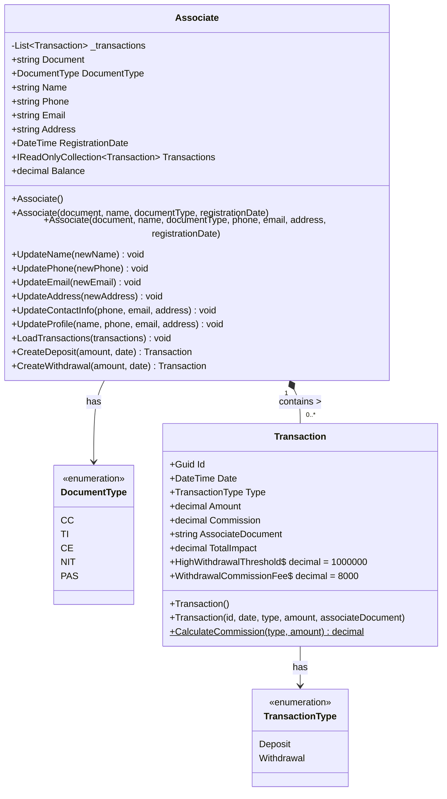

# Cooperativa Financiera El Progreso - Core Bancario, Módulo de Caja & Portal Web

Solución integral y de grado empresarial de core bancario, ventanilla de caja y reportes gerenciales desarrollada con **.NET 10**, **C#**, **Clean Architecture** y el sistema de diseño institucional **Impeccable** (*The Sovereign Ledger House*) para la *Cooperativa Financiera El Progreso*.

---

## 1. Descripción del Sistema

La **Cooperativa Financiera El Progreso** custodia los fondos de ahorro de más de 300 asociados en Colombia. Esta plataforma proporciona una solución doble y complementaria:

1. **Portal Web Institucional & Core de Caja (`ElProgreso.Coop.Web`)**: Aplicación web SPA moderna, accesible y de alta fidelidad visual que integra cotización TRM oficial en tiempo real, simulador de ahorro, ventanilla de operaciones monetarias con comprobantes digitales de caja, ficha 360° del asociado y dashboard ejecutivo de reportes gerenciales con paginación.
2. **Módulo de Terminal Interactivo (`ElProgreso.Coop.Presentation.Console`)**: Interfaz CLI basada en **Spectre.Console** con tablas paginadas, validaciones guiadas y menús fluidos para cajeros y supervisores.

---

## 2. Capacidades y Reglas de Negocio Clave

- **Libro Mayor Inmutable (*Immutable Ledger*)**: El saldo de las cuentas de ahorro **nunca es un campo directamente editable**. Se deriva en tiempo real como la sumatoria de solo lectura de todas las transacciones históricas registradas en el libro mayor contable.
- **Motor Automático de Comisiones**: Tarifa automática de **$8.000 COP** aplicada a retiros que superen el umbral de **$1.000.000 COP** (`HighWithdrawalThreshold`).
- **Sincronización Oficial de TRM en Tiempo Real**: Integración directa y resiliente con la API abierta de la *Superintendencia Financiera de Colombia* (`datos.gov.co`) para consultas de saldo equivalentes en USD y conversor de divisas bidireccional (COP ⇄ USD).
- **Validación Regulatoria Colombiana**: Soporte integral para tipos de documentos oficiales (`CC`, `TI`, `CE`, `NIT`, `PAS`), formato de números de contacto colombianos (7 a 10 dígitos) y convención de nombres tripartitos ($\ge 3$ palabras: nombres + dos apellidos).
- **Guardia de Integridad y Eliminación**: Prohibición estricta de eliminar cualquier asociado que cuente con movimientos históricos registrados en el libro mayor.
- **6 Reportes Gerenciales Consolidados**: Métricas en tiempo real de solvencia, ranking de mejores saldos, asociados dormidos/inactivos, mayores movimientos, resumen por asociado y balance de caja por rango dinámico de fechas.

---

## 3. Arquitectura Limpia por Capas (Clean Architecture)

El proyecto mantiene una estricta separación de responsabilidades en capas independientes:

```
ElProgreso.Coop/
├── .impeccable/                               # Briefs de superficie y esquemas de diseño Impeccable
│   ├── surfaces/index-html.md
│   └── design.json
├── DESIGN.md                                  # Especificación del sistema de diseño ("The Sovereign Ledger House")
├── PRODUCT.md                                 # Definición y visión del producto
├── CLASS_DIAGRAM.md                           # Diagrama de clases y relaciones de dominio
├── src/
│   ├── ElProgreso.Coop.Domain/                # Capa 1: Entidades de Dominio, Enums y Excepciones
│   │   ├── Entities/ (Associate, Transaction)
│   │   ├── Enums/ (DocumentType, TransactionType)
│   │   └── Exceptions/ (DomainException, InsufficientFundsException, etc.)
│   ├── ElProgreso.Coop.Application/           # Capa 2: Casos de Uso, DTOs, Servicios e Interfaces
│   │   ├── DTOs/ (ReportDtos, AssociateFilterCriteria, ExchangeRateResult)
│   │   ├── Interfaces/ (IAssociateRepository, ITransactionRepository, IExchangeRateService, IBankingService, IManagementReportService)
│   │   ├── Services/ (BankingService, ManagementReportService)
│   │   └── Validation/ (AssociateValidator, ValidationResult)
│   ├── ElProgreso.Coop.Infrastructure/        # Capa 3: Persistencia LiteDB, APIs Externas y Seeding
│   │   ├── Data/ (LiteDbContext, DatabaseSeeder)
│   │   ├── Repositories/ (LiteDbAssociateRepository, LiteDbTransactionRepository)
│   │   └── Services/ (ExchangeRateService)
│   ├── ElProgreso.Coop.Presentation.Console/  # Capa 4A: Interfaz de Terminal (Spectre.Console)
│   │   ├── ConsoleUi.cs
│   │   ├── CashierApp.cs
│   │   └── Program.cs
│   └── ElProgreso.Coop.Web/                   # Capa 4B: Host Web API (.NET 10) & Frontend SPA
│       ├── Program.cs                         # Minimal APIs REST & Static Files Server
│       ├── appsettings.json
│       └── wwwroot/                           # Frontend Institucional Impeccable
│           ├── index.html                     # SPA con 3 Modos (Portal, Caja & Directorio, Reportes)
│           ├── css/                           # tokens.css, components.css, trm-widget.css
│           └── js/                            # app.js (API Client, Estado y Paginador de Reportes)
└── tests/
    └── ElProgreso.Coop.Tests/                 # Suite de 64 Pruebas Unitarias y de Integración
        ├── DomainTests.cs
        ├── ApplicationTests.cs
        ├── InfrastructureTests.cs
        └── ValidatorTests.cs
```

---

## 4. Diagrama de Dominio y Relaciones


```mermaid
classDiagram
    %% DOMAIN LAYER
    class DocumentType {
        <<enumeration>>
        CC
        TI
        CE
        NIT
        PAS
    }

    class TransactionType {
        <<enumeration>>
        Deposit
        Withdrawal
    }

    class Associate {
        -List~Transaction~ _transactions
        +string Document
        +DocumentType DocumentType
        +string Name
        +string Phone
        +string Email
        +string Address
        +DateTime RegistrationDate
        +IReadOnlyCollection~Transaction~ Transactions
        +decimal Balance
        +Associate()
        +Associate(document, name, documentType, registrationDate)
        +Associate(document, name, documentType, phone, email, address, registrationDate)
        +UpdateName(newName) void
        +UpdatePhone(newPhone) void
        +UpdateEmail(newEmail) void
        +UpdateAddress(newAddress) void
        +UpdateContactInfo(phone, email, address) void
        +UpdateProfile(name, phone, email, address) void
        +LoadTransactions(transactions) void
        +CreateDeposit(amount, date) Transaction
        +CreateWithdrawal(amount, date) Transaction
    }

    class Transaction {
        +Guid Id
        +DateTime Date
        +TransactionType Type
        +decimal Amount
        +decimal Commission
        +string AssociateDocument
        +decimal TotalImpact
        +HighWithdrawalThreshold$ decimal = 1000000
        +WithdrawalCommissionFee$ decimal = 8000
        +Transaction()
        +Transaction(id, date, type, amount, associateDocument)
        +CalculateCommission(type, amount)$ decimal
    }

    Associate "1" *-- "0..*" Transaction : contains >
    Associate --> DocumentType : has
    Transaction --> TransactionType : has
```

---

## 5. Plataforma Web & Endpoints REST API (.NET 10)

El proyecto `ElProgreso.Coop.Web` expone una API REST moderna basada en **Minimal APIs** junto a su interfaz web SPA servida desde `wwwroot/`:

### Catálogo de Endpoints REST

| Método | Endpoint | Descripción |
| :--- | :--- | :--- |
| `GET` | `/api/associates` | Listar todos los asociados o buscar por coincidencia de texto (`?query=`). |
| `GET` | `/api/associates/{doc}` | Obtener ficha detallada de un asociado con saldo calculado. |
| `POST` | `/api/associates` | Registrar nuevo asociado con validación de nombres tripartitos y contacto. |
| `PUT` | `/api/associates/{doc}` | Actualizar información de perfil y contacto de un asociado. |
| `DELETE`| `/api/associates/{doc}` | Eliminar asociado (protegido por guardia de historial). |
| `POST` | `/api/transactions/deposit` | Registrar consignación monetaria en cuenta de ahorros. |
| `POST` | `/api/transactions/withdraw` | Registrar retiro con cálculo y deducción automática de comisión. |
| `GET` | `/api/transactions/associate/{doc}` | Consultar historial cronológico de transacciones de un asociado. |
| `GET` | `/api/trm/live` | Obtener cotización oficial de la TRM del día sincronizada desde datos.gov.co. |
| `GET` | `/api/reports/overview` | Reporte 1: Consolidado general (Total asociados, saldo total, promedio). |
| `GET` | `/api/reports/top-associates` | Reporte 2: Top 5 asociados con mayores saldos en custodia. |
| `GET` | `/api/reports/dormant-associates` | Reporte 3: Asociados inactivos sin transacciones registradas. |
| `GET` | `/api/reports/largest-transactions` | Reporte 4: Top 10 transacciones de mayor valor en la cooperativa. |
| `GET` | `/api/reports/cashier-movement` | Reporte 5: Resumen consolidado de movimientos por asociado. |
| `GET` | `/api/reports/date-range-summary` | Reporte 6: Balance de caja por rango de fechas (`?start=&end=`). |

---

## 6. Sistema de Diseño Impeccable (*The Sovereign Ledger House*)

La interfaz visual se rige estrictamente por los principios de diseño documentados en [`DESIGN.md`](DESIGN.md):

- **Paleta de Colores Institucional:**
  - *Deep Obsidian Green* (`#062319`): Estructuras de anclaje, cabeceras y contrastes principales.
  - *Forest Green* (`#0b3828`): Color institucional de marca para tarjetas principales y acciones primarias.
  - *Rich Antique Gold* (`#b38515`) & *Bright Gold* (`#d4a32c`): Acentos económicos de alta jerarquía.
  - *Architectural Canvas* (`#f2f6f4`): Lienzo pétreo de fondo con alto contraste y descanso visual.
- **Tipografía y Legibilidad:**
  - *Display / Titulares:* `Marcellus` (serif dignificado).
  - *Cuerpo e Interfaz:* `Manrope` (sans geométrica de alta legibilidad).
  - *Cifras y Datos:* `JetBrains Mono` con `font-variant-numeric: tabular-nums` (*The Tabular Truth Rule*).
- **Acabado y Calidad (*Craft Floor*):**
  - Sombras naturales con desenfoque suave (sin halos artificiales ni neones).
  - Contraste estricto según estándares WCAG AA (>4.5:1 / >7:1 en badges dorados).
  - Auditoría mecánica continua con 0 defectos detectados mediante `impeccable detect`.

---

## 7. Guía de Ejecución y Pruebas

### Prerrequisitos
- [.NET 10 SDK](https://dotnet.microsoft.com/download) instalado en el sistema.

### Ejecutar el Portal Web (Recomendado)
Para iniciar el servidor web con soporte de recarga en vivo (*live-reload*):

```bash
dotnet watch --project src/ElProgreso.Coop.Web
```
> Abre tu navegador en **`http://localhost:5000`** para acceder a la aplicación.

### Ejecutar la Aplicación de Consola (CLI)
Para interactuar con la terminal de caja:

```bash
dotnet run --project src/ElProgreso.Coop.Presentation.Console
```

### Ejecutar la Suite de Pruebas Automatizadas
Para ejecutar las 64 pruebas unitarias y de integración:

```bash
dotnet test
```

### Auditar la Interfaz Web con Impeccable
Para validar el cumplimiento del sistema de diseño y accesibilidad:

```bash
impeccable detect src/ElProgreso.Coop.Web/wwwroot/index.html
```

---

## 8. Patrones de Diseño Aplicados

1. **Repository Pattern (`IAssociateRepository`, `ITransactionRepository`)**: Aísla la capa de persistencia (LiteDB) de las reglas de negocio.
2. **Aggregate Root (DDD)**: `Associate` administra el límite de consistencia transaccional y calcula el saldo a partir de `_transactions`.
3. **Factory Method**: Creación validada de transacciones mediante `Associate.CreateDeposit()` y `Associate.CreateWithdrawal()`.
4. **Dependency Injection**: Inversión de control configurada nativamente en `Program.cs`.
5. **DTO & Result Pattern**: Transferencia segura de datos y resultados tipados para reportes y validaciones.

---

© 2026 Cooperativa Financiera El Progreso. Todos los derechos reservados.
